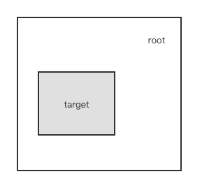
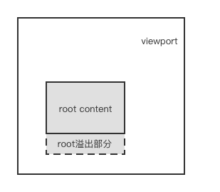
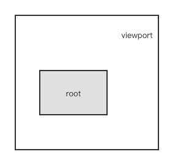

# Intersection Observer API

Intersection Observer API 提供了一种**异步**检测目标元素与祖先元素或 viewport **相交情况**变化的方法。

## 概念和用法

Intersection Observer API 允许你配置一个回调函数，当以下情况发生时会被调用

- 每当目标(target)元素与设备视窗或者其他指定元素发生交集的时候执行。设备视窗或者其他元素我们称它为根元素或根(root)。

- Observer 第一次监听目标元素的时候

通常，您需要关注文档最接近的可滚动祖先元素的交集更改，如果元素不是**可滚动元素的后代**，则默认为设备视窗。如果要观察相对于**根(root)元素的交集**，请指定根(root)元素为 null。

无论您是使用视口还是其他元素作为根，API都以相同的方式工作，只要目标元素的**可见性发生变化**，就会执行您提供的**回调函数**，以便它与所需的交叉点交叉。

目标(target)元素与根(root)元素之间的交叉度是交叉比(intersection ratio)。这是目标(target)元素相对于根(root)的交集百分比的表示，它的取值在0.0和1.0之间。

### 创建一个 intersection observer

语法如下：

```js
let observer = new IntersectionObserver(callback, options)
```

构造函数 IntersectionObserver 接收 2 个参数：会调函数和配置对象。

options 是一个用来配置 observer 实例的对象，它具有以下属性：

- root：设置目标元素的根元素，也就是我们用来判断元素是否可见的区域，**必须是目标元素的父级元素**，如果不指定的话，则使用浏览器视窗，也就是 document。

- rootMargin：根(root)元素的外边距。类似于 CSS 中的 margin 属性，比如 "10px 20px 30px 40px" (top, right, bottom, left)。如果有指定 root 参数，则 rootMargin 也可以使用百分比来取值。该属性值是用作 root 元素和 target 发生交集时候的计算交集的区域范围，使用该属性可以控制 root 元素每一边的收缩或者扩张。默认值为0。

- threshold：可以是**单一的 number 也可以是 number 数组**，target 元素和 root 元素相交程度达到该值的时候 IntersectionObserver 注册的回调函数将会被执行。如果你只是想要探测当 target 元素的在 root 元素中的可见性超过50%的时候，你可以指定该属性值为0.5。如果你想要 target 元素在 root 元素的可见程度每多25%就执行一次回调，那么你可以指定一个数组 [0, 0.25, 0.5, 0.75, 1]。默认值是0 (意味着只要有一个 target 像素出现在 root 元素中，回调函数将会被执行)。该值为1.0含义是当 target 完全出现在 root 元素中时候 回调才会被执行。

callback 有 2 个参数：entries 和 observer。

```js
let callback = (entries, observer) => {
  entries.forEach(entry => {
    // Each entry describes an intersection change for one observed target element:
    // entry.boundingClientRect
    // entry.intersectionRatio
    // entry.intersectionRect
    // entry.isIntersecting
    // entry.rootBounds
    // entry.target
    // entry.time
  })
}
```

请留意，你注册的回调函数将会在主线程中被执行。所以该函数执行速度要尽可能的快。如果有一些耗时的操作需要执行，建议使用 Window.requestIdleCallback() 方法。

### 交集是如何计算的

首先必须要明确的一个基本点是，所有区域均被 Intersection Observer API 当做一个矩形看待。因此，任何图形都会被当作一个最小矩形来计算。

#### root 和 rootMargin

在我们开始跟踪 target 元素和容器元素之前，我们要先知道什么是容器 (root) 元素。容器元素又称为 intersection root，或 root element。 这个既可以是 target 元素祖先元素也可以是指定 null 则使用浏览器视口做为容器(root)。

root intersection rectangle 是用来对目标元素进行相交检测的矩形，它的大小有以下几种情况:

- 如果 intersection root 隐含 root (值为null) (也就是顶级 Document), 那么 root intersection 矩形就是视窗的矩形大小。



- 如果 intersection root 有溢出部分, 则 root intersection 矩形是 root 元素的内容 (content) 区域.



- 否则，root intersection 矩形就是 intersection root 的 bounding client rectangle (可以调用元素的 getBoundingClientRect() 方法获取).



用作描述 intersection root 元素边界的矩形可以使用 root margin 来调整矩形大小，即 rootMargin 属性，在我们创建 IntersectionObserver 对象的时候使用。rootMargin 的属性值将会做为 margin 偏移值添加到 intersection root 元素的对应的 margin 位置，并最终形成 root 元素的矩形边界 (在执行回调函数时可由 IntersectionObserverEntry.rootBounds (en-US) 得到)。

#### Thresholds

IntersectionObserver API 始终会在元素每次发生交集变化后根据 Thresholds 的值执行回调。Thresholds 是 [0, 1] 闭区间范围的数值，可以是单个数值也可以是数组，表示交集达到多少百分比时执行回调。

#### 剪切和交叉矩形

浏览器计算最终的交叉点矩形如下，这一切不需要开发者去执行，但了解这些步骤可以有助于更好地掌握交叉点。

1. 目标元素的边界矩形（即，完全包含构成元素的每个组件的边界框的最小矩形）是通过在目标上调用getBoundingClientRect() 来获取构成元素的边界框。这将会是最大的交叉矩形。其余步骤将删除任何不相交的部分。

2. 从目标的直接父级块开始并向外移动，每个包含块的剪切应用于交叉矩形。基于由溢出属性指定的两个块和剪切模式（如果有的话）确定块的剪切。将溢出部分设置为任何内容，但只要元素可见就会导致剪切发生。

3. 如果其中一个元素是嵌套浏览上下文的根源（例如在<iframe>中包含的文档，则交叉矩形被剪切到包含上下文的视口，并且通过容器的包含块向上递归。因此，如果达到<iframe>的顶级，则交集矩形将剪切到框架的视口，然后帧的父元素是下一个块通过朝向交叉点传递给root。

4. 当向上递归到达交叉点根时，将得到的矩形映射到交叉点根的坐标空间。

5. 然后通过将其与根交叉矩形交叉来更新所得到的矩形。

6. 最后，此矩形映射到目标文档的坐标空间。

#### 交集变化回调

当在 root 元素内可见的目标元素的量交叉于一个可见度阈值之一时，执行 intersectionObserver 对象的回调。回调接收为输入所有 intersectobserverentry 对象的数组，一个用于跨越的每个阈值，以及对 intersectionObserver 对象本身的引用。

阈值列表中的每个条目都是描述交叉的一个阈值的intersectobserverentry对象。也就是说，每个条目描述了给定元素与根元素交叉的百分比，无论元素是否被认为是相交的，以及发生转换的方向。

## 应用

1. 图片懒加载

2. 无限滚动列表

3. 吸顶

4. 埋点上报

## 参考资料

[MDN Intersection Observer API](https://developer.mozilla.org/zh-CN/docs/Web/API/Intersection_Observer_API)
[Intersection Observer API使用教程](https://www.ruanyifeng.com/blog/2016/11/intersectionobserver_api.html)