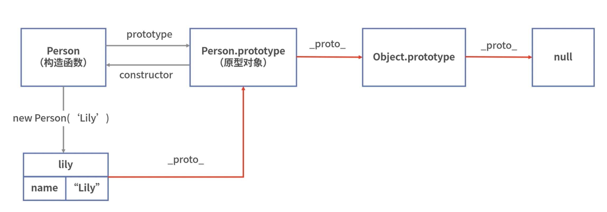

## 原型对象 prototype

重点说下函数，默认情况下，所有函数的原型对象（prototype）都拥有 constructor 属性和 __proto__ 属性，constructor 指向与之关联的构造函数。而原型对象作为对象，仍然拥有自己的原型对象，用 __proto__ 来表示。

这样就可以理解 new 操作符的具体执行逻辑了，有以下代码：

```js
var person = new Person('Jack')
```

JavaScript 引擎线程执行的时候，会按照以下步骤来执行：

1. 创建一个空对象

```js
var person = {}
```

由于对象不是函数，所以此时空对象只有一个[[prototype]]（浏览器中对 __proto__ 的实现，两者意义相同），指向的是 Object 对象，那么就需要通过 __proto__ 来修改指向的原型对象。

2. 修改 __proto__ 的指向

```js
person.__proto__ = Person.prototype
```

修改后的 person 空对象 __proto__ 指向了 Person.prototype，接下来就要使用到 Person.prototype 里的 2 个属性（constructor 和 __proto__）之一的 constructor 了。

3. 使用构造函数

```js
Person.call(person, ‘Jack’)
```

经过上述步骤，就形成了如下的关系链：



函数才有 prototype 属性，并且属性值必须是对象类型，而对象才有 `__proto__` 属性，是一个指针，指向一个原型对象。于是这种一层层的指向原型对象，就构成了原型链，直到最后指向的是 null（猜测设计 JavaScript 的时候，使用 typeof 检测对象和 null 为什么都是 'object' 了）。

具体可以查看 [搞懂JS中的prototype、__proto__与constructor](https://blog.51cto.com/u_14582976/5104838)。

在 js 里，函数本质上也是对象，而对象继承时都会有 __proto__ 和 constructor 两个属性，所以构造函数也有 __proto__ 属性。

```js
function A () {}
A.__proto__ === A.constructor.prototype // true
```
