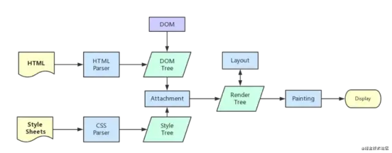

# 从输入 URL 开始

## DNS 查询

在这一步能做的优化是 DNS 预查询，具体的做法是在 html 文档顶部插入一个 link 标签。

```html
<link rel="dns-prefetch" href="https://fonts.googleapis.com/" />
```

来告知浏览器我们将要从这个地址(通常会是存放静态资源的 CDN 的地址，)拉取数据了，你先查询一下，当用到的时候就可以直接拿到对应的 IP。

## 建立 HTTP（TCP）连接

得到服务器 IP 之后，首先进行三次握手，之后会进行 SSL 握手(HTTPS)，SSL 握手时会向服务器端确认 HTTP 的版本。

针对这方面的优化，前端可做的事情不多，主要是服务器端的事情，不过仍然要了解一下前端可以看得到的策略。

### keep-alive

由于 TCP 的可靠性，每条独立的 TCP 连接都会进行三次握手，从 Network 的分析中可以看出建立 TCP 连接往往会消耗大部分时间，真正的数据传输反而会少一些(当然取决于内容多少)。HTTP1.0 和 HTTP1.1 为了解决这个问题在 header 中加入了 Connection: Keep-Alive，keep-alive 的连接会保持一段时间不断开，后续的请求都会复用这一条 TCP，不过由于管道化的原因也会发生**队头阻塞**的问题。

HTTP1.1 默认开启 Keep-Alive。

### http2.0

HTTP2 相对于 HTTP1.1 的一个主要升级是多路复用，多路复用通过更小的二进制帧构成多条数据流，交错的请求和响应可以并行传输而不被阻塞，这样就解决了 HTTP1.1 时复用会产生的队头阻塞的问题，同时 HTTP2 有首部压缩的功能，如果两个请求首部(headers)相同，那么会省去这一部分，只传输不同的首部字段，进一步减少请求的体积。

Nginx 开启 HTTP2 的方式特别容易，只需要加一句 http2 既可开启：

```shell
server {
  listen 443 ssl http2;
  server_name domain.com;
}
```

### 缓存

缓存通过复用之前的获取过的资源，可以显著提高网站和应用程序的性能，不仅可以节省流量，而且能给用户带来流畅的体验。

HTTP 缓存主要分为两种，一种是强缓存，另一种是协商缓存，都通过 Headers 控制。

#### 强缓存

强缓存根据请求头的 Expires 和 Cache-Control 判断是否命中强缓存，命中强缓存的资源直接从本地加载，**不会发起任何网络请求**。

Cache-Control 的值有很多：

```shell
Cache-Control: max-age=<seconds>
Cache-Control: max-stale[=<seconds>]
Cache-Control: min-fresh=<seconds>
Cache-control: no-cache
Cache-control: no-store
Cache-control: no-transform
Cache-control: only-if-cached
```

常用的有 max-age，no-cache 和 no-store。

#### 协商缓存

协商缓存一般会在**强缓存新鲜度过期后**发起，向服务器确认是否需要更新本地的缓存文件，如果不需要更新，服务器会返回 304，否则会重新返回整个文件。

服务器响应中会携带 ETag 和 Last-Modified，Last-Modified 表示本地文件最后修改日期，浏览器会在 request header 加上 If-Modified-Since（上次返回的 Last-Modified 的值），询问服务器在该日期后资源是否有更新，有更新的话就会将新的资源发送回来。

协商缓存比强缓存稍慢，因为还是会发送请求到服务器进行确认。

#### CDN

CDN 会把源站的资源缓存到 CDN 服务器，当用户访问的时候就会从最近的 CDN 服务器拿取资源而不是从源站拿取，这样做的好处是分散了压力，同时也会提升返回访问速度和稳定性。

### 压缩

浏览器在发起请求时会在 headers 中携带 accept-encoding: gzip, deflate, br，告知服务器客户端可以接受的压缩算法，之后响应资源会在响应头中携带 content-encoding: gzip 告知本文件的压缩算法。

#### GZIP 压缩

GZIP 是非常常用的压缩算法，现代客户端都会支持，你可以在上传文件时就上传一份压缩后的文件，也可以让 Nginx 动态压缩。

## 进行页面渲染

### 关键渲染路径



浏览器得到 HTML 后会开始解析 DOM 树，CSS 资源的下载不会阻塞解析 DOM，但是也要注意，如果 CSS 未下载解析完成是会阻塞最终渲染的。

#### 预加载/预连接内容

和前面说的 DNS 预查询一样，可以将即将要用到的资源或者即将要握手的地址提前告知浏览器让浏览器利用还在解析 HTML 计算样式的时间去提前准备好。

1. preload

使用 link 的 preload 属性预加载一个资源。

```html
<link rel="preload" href="style.css" as="style" />
```

as 属性可以指定预加载的类型，除了 style 还支持很多类型，常用的一般是 style 和 script，css 和 js。

2. prefetch

prefetch 和 preload 差不多，prefetch 是一个低优先级的获取，通常用在这个资源可能会在用户接下来访问的页面中出现的时候。

**当然对当前页面的要用 preload，不要用 prefetch，可以用到的一个场景是在用户鼠标移入 a 标签时进行一个 prefetch。**

3. preconnect

preconnect 和 dns-prefetch 做的事情类似，提前进行 TCP，SSL 握手，省去这一部分时间，基于 HTTP1.1(keep-alive) 和 HTTP2 (多路复用)的特性，都会在同一个 TCP 连接内完成接下来的传输任务。

4. script 加标记

- async

async 标记告诉浏览器在等待 js 下载期间可以去干其他事，当 js 下载完成后会立即(尽快)执行，多条 js 可以并行下载。

- defer

与 async 一样，defer 标记告诉浏览器在等待 js 下载期间可以去干其他事，多条 js 可以并行下载，不过当 js 下载完成之后不会立即执行，而是会等待解析完整个 HTML 之后在开始执行.

两个标记都是为了让 script 标签实现异步下载，主要的区别在于 async 无法保证顺序且下载完就会执行而 defer 则会等待整个 HTML 解析之后才会开始执行，并且按照插入的顺序执行。

如果两个 script 之间没有依赖关系并且可以尽快执行的更加适合使用 async，反之如果两个 script 之间有依赖关系，或者希望优先解析 HTML，则 defer 更加适合。

5. 视窗外的内容懒加载

通常懒加载会与 loading 和骨架屏等技术搭配使用。

6. 减少无意义的回流

回流（重排）和重绘，排版和绘制。

7. 图片视频选择合理的尺寸

分辨率越高的图片显示出来越消耗性能，当然带来的好处是更加的清晰，但很多情况下清晰并不是一个特别重要的标准，我们可以牺牲一部分清晰度来让图片视频体积更小，通常 PC 使用 1 倍图，移动端使用 2 倍图就够了，原图可以结合懒加载等待空闲或者主动触发时在加载，像是微信 QQ 等聊天时发的表情包一样，都是点开才会加载原图。

# 写代码时可以做的事

## Tree-shaking

Tree-shaking 指的是消除没被引用的模块代码，减少代码体积大小，以提高页面的性能，最初由 rollup 提出。

webpack2 加入对 Tree-shaking 的支持，webpack4 中 Tree-shaking 默认开启，Tree-shaking 基于 ESModule 静态编译而成，所以如果想要生效，在写代码的时候注意不要用 CommonJS 的模块，同时也要注意不要让 babel 给编译成 CommonJS 的形式。

Tree-shaking 连带的有一个 sideEffects 的概念，因为 JS 的特性使得完全静态分析是一个很难的事情，很多代码往往会带有副作用，比如一下代码:

```js
class Handler {
  handleEvent() {
    console.log("You called me.");
  }
}

window.addEventListener("visibilitychange", new Handler());
```

在上面的代码中不存在任何显式的调用 handleEvent，但当 visibilitychange 发生时 Js 会去调用 handleEvent，这个类就属于有副作用的一种，它是不能被抖掉的代码（实际上 webpack 也不会对类有啥想法）。

如果你确定某个文件是这种含有副作用的文件，可以在 package.json 中添加 sideEffects: ['class.js'] 让 webpack 强行打包进去。

## 压缩

## 使用动态import()代替静态import做条件渲染的懒加载

## SSR

**利用服务器端优先渲染出某一部分重要的内容，让其他内容懒加载**，这样到达浏览器端时一部分HTML已经存在，页面上就可以呈现出一定的内容，这里注意服务器端渲染出来的HTML部分最好不要超过14kb，TCP慢开始的规则让第一个TCP包的大小是14kb，这是与网站交互会接受到的第一个包。

## 参考文档

[你知道的前端优化手段](https://mp.weixin.qq.com/s/vL9iBqmF-BQEIpalDdRmkg)
