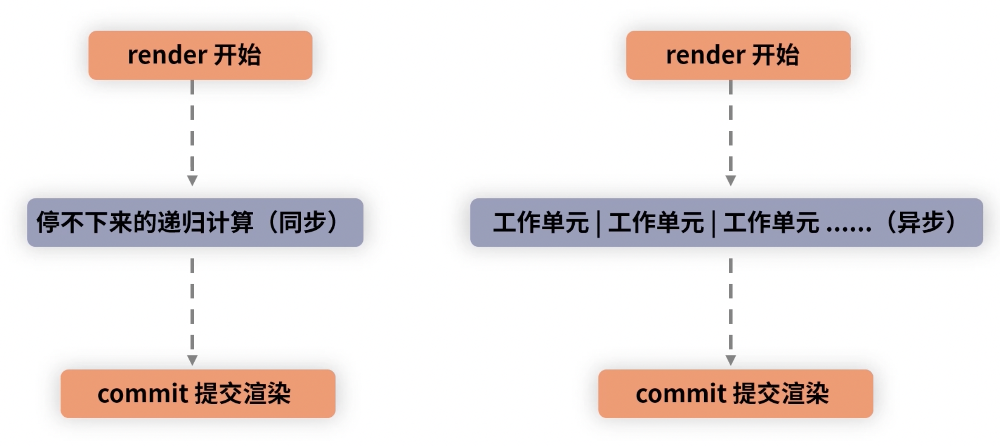

## stack reconciler

在 diff 时是同步递归的，会导致 js 线程长时间占据主线程，导致 UI 界面卡顿、无响应。

## fiber

比线程更细，叫做“纤程”，可以更加细粒度地控制 diff 过程。

### fiber 架构核心

可中断、可恢复、优先级。从原先 reconciler -> renderer 两层架构升级为 sscheduler -> reconciler -> renderer。

- 每个任务到达调度器时，会被赋予优先级
- 如果新来的任务优先级更高，原先的任务会被中断，会先执行优先级更高的任务
- reconciler 过程找不同后，接下来就是 commit 提交渲染

新老架构工作流程对比：

## ReactDOM.render 如何串联渲染链路

**初始化阶段**

render 有如下三种模式：

1. legacy 模式：ReactDOM.render(<App />, rootNode) -> 同步
2. blocking 模式：模式：ReactDOM.createBlockingRoot(rootNode).render(<App />)
3. concurrent 模式：ReactDOM.createRoot(rootNode).render(<App />) -> 异步

在引入 fiber 架构后，因为目前 ReactDOM.render 默认使用 legacy 模式，所以首次渲染是同步的，后续更新是异步的。在未来，ReactDOM.render 会默认使用 concurrent 模式，使得其完全符合 fiber 的设计理念。

## fiber 架构下 concurrent 模式实现原理

