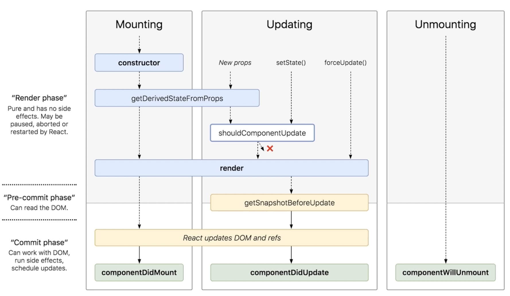

## componentReceiveProps

componentReceiveProps 是由父组件更新（re-render）触发的，如果想要避免 props 未改变时也会触发子组件更新，可以在 shouldComponentUpdate 函数里决定是否要更新子组件，返回 false 就不会执行后续生命周期方法。

## componentWillUnmount：组件卸载

组件卸载分为以下几种情况：

- 子组件被父组件移除
- 组件设置了 key，父组件在 re-render 时发现 key 和上一次不一致

## React 16(16.0-16.3) 版本中的生命周期

在 16 版本中生命周期工作流程图如下：



### getDerivedStateFromProps

```js
static getDerivedStateFromProps(props, state)
```

**getDerivedStateFromProps 是一个静态方法，因此不会被实例化，在实例中你访问不到 this。**

getDerivedStateFromProps 方法对 state 不是覆盖式更新，而是对某个属性的定向更新。

```js
static getDerivedStateFromProps(props, state) {
  return {
    fatherText: 'fatherText'
  }
}

this.state = {
  text: 'text'
}
```

上述情况下组件的 text 不会被覆盖，此时还会新增一个 fatherText 属性。

### getSnapshotBeforeUpdate

```js
getSnapshotBeforeUpdate(prevProps, prevState)
```

该函数返回值会作为 componentDidUpdate 第三个参数传递，这两个 API 之间可以借此实现通信。

### fiber 架构

React 16 对生命周期所做的变化是为 fiber 做铺垫，在 16 版本之前，react 渲染是以同步递归的形式实现的，在这个阶段浏览器没办法处理渲染之外的事情。引入 fiber 后，渲染被打断为一片一片的异步流程，这么做就是可以周期性地把控制权交给浏览器，避免一次性递归同步渲染带来的卡顿。

根据“能否被打断”这一标准，react 16 生命周期才被划分为了 render 和 commit 两个阶段。render 阶段是允许被打断的，可以暂停、终止和重启的，而 commit 阶段总是同步执行的。

所以再来看废弃的 API：componentWillMount、componentWillUpdate 和 componentWillReceiveProps，因为它们仨都是在 render 阶段，在 fiber 架构里会导致重复执行的问题。