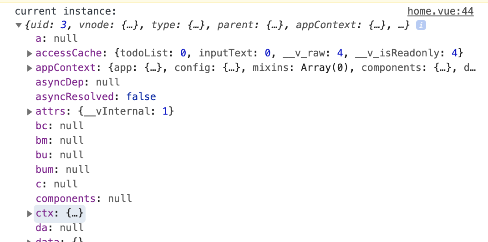
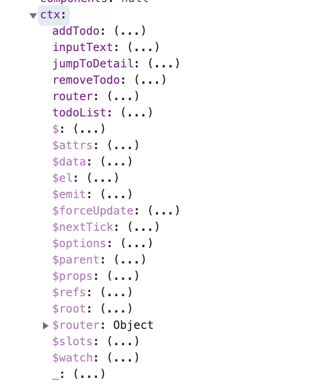
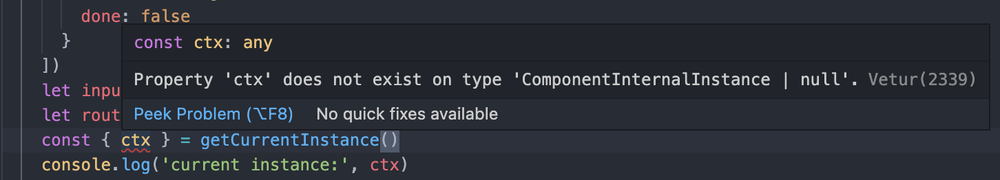
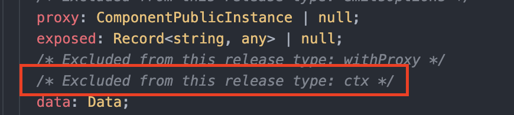
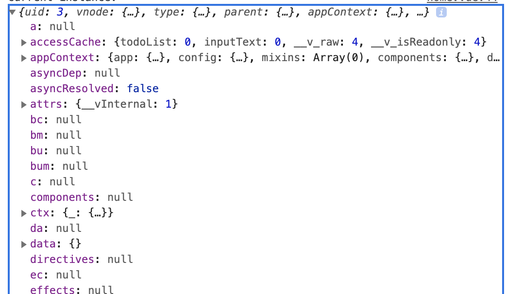
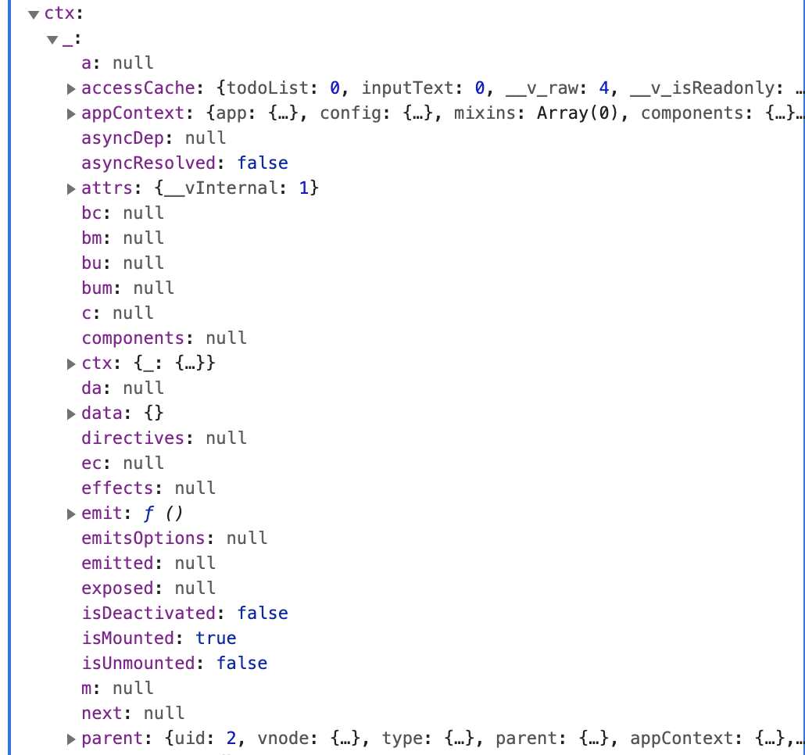

# vue3 + ts 初体验

## 背景

自从去年尤大大发布 vue3.0 之后，已经过去了大半年。前不久高产的尤大大又发布了 vite2.0，让我等搬码仔终日惶恐不安，因此就想对 vue3 进行探索学习，想了解相较于 vue2.0 哪些地方做了改变，以及新增了哪些特性。我先大体阅读了一下 vue2.0 迁移指南，然后就从创建一个最简单的 todo mvc 开始了探索学习之旅。

## 创建项目

我这里直接用的迁移文档里提供的 vite 脚手架创建了项目，现在越来越多的开发者进行了 typescript 迁移，因此我就选择了基于 typescript 来进行开发。

## 定义路由

### 编写路由

home 页用于显示 todo 列表，点击列表项进入 detail 页显示 todo 详情。新建 router 目录如下：

```
router
├─index.ts
```

在 vue-router4.0 中，提供了两种创建 history 的方式，分别是 `createWebHistory` 和 `createWebHashHistory`。由于采用了 typescript 编码，在定义 routes 常量时，需要声明类型为 `Array<RouteRecordRaw>`。

```ts
import { createRouter, createWebHistory, RouteRecordRaw } from 'vue-router'
import { defineAsyncComponent } from 'vue'

const routes: Array<RouteRecordRaw> = [
  {
    path: '/',
    redirect: '/home'
  },
  {
    path: '/home',
    name: 'home',
    component: defineAsyncComponent(() => import('../pages/home.vue'))
  },
  {
    path: '/detail',
    name: 'detail',
    component: defineAsyncComponent({
      loader: () => import('../pages/detail.vue'),
      delay: 200,
      timeout: 3000
    })
  }
]

const router = createRouter({
  history: createWebHistory(),
  routes
})

export default router
```

在 vue3.0 里，通过 `defineAsyncComponent` 来定义异步组件。如果需要对异步组件进行配置，可以传递一个对象进去，在 vue2.0 中的 component 被重命名为了 loader，而且需要注意的是，loader 函数本身不再接受 resolve 和 reject，且必须返回一个 Promise，保证异步加载始终按照预期工作。

### 应用路由

最后需要在 main.ts 里应用定义好的路由，main.ts 文件内容如下：

```ts
import { createApp } from 'vue'
import App from './App.vue'
import router from './router'

const app = createApp(App)

app.use(router)

app.mount('#app')
```

同时也可以看到，在 vue3.0 中，是通过 createApp 函数来创建根实例，而在 vue2.0 中是通过 new Vue() 来创建根实例的。

## 关于 setup

在 vue2.0 中，在编写组件代码时是基于选项 API 来进行的，通过 `data`、`watch`、`computed`、`methods`等不同的选项来组织代码逻辑。然而当组件变得很大时，**逻辑关注点**的列表就会增长，这将导致逻辑碎片化，比如当我们关注某个单个逻辑点时，会频繁地跳转不同的代码选项块，以至于难以阅读和理解代码逻辑。

因此在 vue3.0 当中，出现了组合式 API。它的核心理念就是，将与同一个逻辑关注点的代码组合在一起，为了能够这样使用，就得提供一个使用的地方，因此出现了 setup 函数。

setup 函数在创建组件之前执行，并且可以接受一个 props 参数和一个 context 参数。一旦 props 被解析，就作为组合式 API 的入口点。

> <font color="red">由于在执行 setup 时，组件实例尚未被创建，因此无法使用 this，因此只能通过 props 访问组件中声明的属性。</font>

因为 setup 函数是围绕 beforeCreate 和 created 钩子函数运行的，所以在 vue3.0 里这两个函数就不需要了，在这两个函数里编写的任何代码都应该直接放在 setup 函数里。

## 创建组件

在 src 目录下新建 pages 文件夹，并在其下新建 `home.vue` 和 `detail.vue`。

```
pages
├─home.vue
├─detail.vue
```

### 编写 home 组件

对于 todomvc 来说，一个 todo 项至少包含两个属性 —— 待办事项和状态，因此定义接口 Todo：

```ts
interface Todo {
  text: string,
  done: boolean
}
```

接着就可以定义 todolist 类型了，这是一个复杂数据类型。在 vue3.0 里，如果要定义基本数据类型作为响应式，那么需要使用 ref；如果要定义复杂数据类型作为响应式，就需要使用 reactive，因此这里使用 reactive 来定义对象数组类型：

```ts
import { defineComponent, ref, reactive } from 'vue'

export default defineComponent({
  setup (props, context) {
    let todoList = reactive<Array<Todo>>([
      {
        text: 'learn js',
        done: true
      },
      {
        text: 'learn java',
        done: false
      }
    ])
  }
})
```

由于需要动态添加待办事项，因此需要再定义一个字符串类型的数据，用来接收用户输入：

```ts
let inputText = ref('')
```

这里可以不用显示地添加类型约束，因为 typescript 会根据 ref 接收的参数自动推断出类型为 string。

一个 todomvc 离不开新增和删除，因此我们接着定义 addTodo、removeTodo 两个方法。

```ts
const addTodo = () => {
  // 记住这里是 `inputText.value`，这是因为基本数据类型被包装成了一个响应式对象，此时只能通过 value 属性来使用它的值
  if (inputText.value.trim().length) {
    const item = {
      text: inputText.value,
      done: false
    }
    todoList.push(item)
    inputText.value = ''
  }
}
const removeTodo = (index: number) => {
  todoList.splice(index, 1)
}
```

最后必不可少的一步就是在 setup 函数里 return 我们前面定义好的数据和方法，这是因为模版渲染时会使用到它们：

```ts
setup (props, context) {
  // 此处省略...
  return {
    todoList,
    inputText,
    addTodo,
    removeTodo
  }
}
```

### 编写 detail 组件

detail 组件很简单，只需要显示路由跳转时传递过来的待办事项对象即可，包括了待办事项和状态。但是在跳转前，需要在 `home.vue` 定义路由跳转的方法。

**使用 vue-router4.0**

vue-router4.0 提供了新的使用方法，即使用 router 或者 route 时需要我们自己去 import 提供的 `useRouter` 和 `useRoute` 函数。为了使用 router 进行路由跳转，需要手动 import。

```ts
// home.vue
import { useRouter, RouteLocationOptions } from 'vue-router'

export default defineComponent({
  setup (props, context) {
    let router = useRouter()
    // ...
    const jumpToDetail = (item: Todo) => {
      router.push({
        name: 'detail',
        params: {
          text: item.text,
          done: item.done
        }
      } as RouteLocationOptions)
    }

    return {
      todoList,
      inputText,
      addTodo,
      removeTodo,
      jumpToDetail,
      router
    }
  }
})
```

> 需要注意的是，我们这里路由跳转是通过 push 对象的形式来完成的，因此需要指定这个对象是 RouteLocationOptions 类型，这个类型是 vue-router 为我们提供的。如果 push 的是一个字符串，那么就需要指定这个字符串类型为 RouteLocationRaw。

**获取路由参数**

如上所述，在 vue-router4.0 中，如果要获取某个路由对象，需要使用 useRoute，因此需要手动 import。

```html
<template>
  <div id="detail">
    <h2>将来要做什么: {{ todo.text }}</h2>
    <h2>状态：<input type="checkbox" v-model="checked"/>{{ todo.done ? '已完成' : '未完成' }}</h2>
  </div>
</template>
```

```ts
import { useRoute } from 'vue-router'
import { ref, reactive, watch, defineComponent } from 'vue'

export default defineComponent({
  name: 'detail',
  setup (props, context) {
    const route = useRoute()
    // 使用 params，刷新页面参数会丢失
    const done = route.params.done === 'true' ? true : false
    let todo = reactive({
      text: route.params.text,
      done
    })
    let checked = ref(todo.done)

    watch(checked, (newV, oldV) => {
      if (newV) {
        todo.done = true
      } else {
        todo.done = false
      }
    }, {
      deep: true
    })

    return {
      todo,
      route,
      checked
    }
  }
})
```

这里需要使用到 watch 函数，方便我们在勾选复选框时，状态能及时改变。不同于 vue2.0 里的 watch 选项，vue3.0 里的 watch 是一个纯函数，并且可以多次使用，它接收的参数包括：监听目标、回调函数和可选项，第三个参数接收一个对象，里面包含深度监听和立即执行选项。

## 关于 getCurrentInstance 获取当前组件实例

在 vue2 里，我们在创建根实例并挂载 router 之后，以后在任何组件里就可以通过 `this.$router.xxx` 来使用路由。但是在 vue3 里，由于 setup 函数是围绕 beforeCreate 和 created 钩子来运行的，因此不能通过 this 获取组件实例。推荐的做法是通过导入 `vue-router` 的 `useRouter` 和 `useRoute` 来路由跳转即获取路由传递的参数。

但是在 vue3 里，提供了 `getCurrentInstance` 函数，顾名思义，这个函数的作用是用于获取当前组件实例的。然后我调用该函数，打印了一下当前实例：



点击查看 ctx 详情：



看起来可以直接像在 `vue2` 里一样通过 `ctx.$router.xxx` 来使用路由，于是我做了下尝试：

```ts
const { ctx } = getCurrentInstance()
console.log('current instance:', ins)
```

但是 typescript 立马就推断出了类型错误：



这里会 ctx 为一个联合类型，既可能为 `ComponentInternalInstance` 类型，也可能为 `null` 类型。我们可以看看 `ComponentInternalInstance` 接口里声明了哪些类型：



这就很奇怪了，为什么我能在上述 `getCurrentInstance` 里拿到 ctx 呢？原来 vite 默认用的是开发环境，这样是便于开发阶段拿到实例，于是我切换到了生产环境：





能看到 ctx 里面没有了 $router 对象，所以在生产环境下通过 `getCurrentInstance` 获取实例来拿到 $router 对象是不可取的，因此最好还是用 vue-router 提供的方式。

以上便是关于 vue3.0 + ts 的初体验。